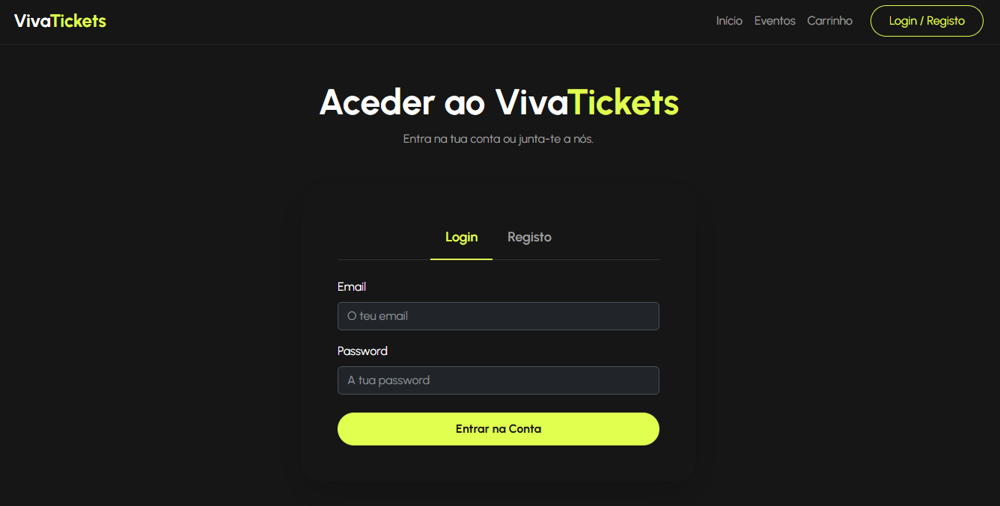

# PROJETO FINAL
# # 🎟️ VivaTickets

> Uma plataforma web completa (Full-Stack) para gestão de bilhética e eventos, focada na experiência do utilizador e na segurança das transações.

## 💻 Sobre o Projeto

O **VivaTickets** é uma aplicação web desenvolvida para facilitar a visualização de eventos, gestão de bandas e a compra de bilhetes online. Este projeto foi concebido para aplicar e consolidar conhecimentos de desenvolvimento Full-Stack, com especial foco na integração entre uma interface dinâmica e uma arquitetura de base de dados relacional robusta.

### Funcionalidades Principais

* **Autenticação de Utilizadores:** Sistema seguro de registo e login, com gestão de sessões e proteção de rotas.
* **Catálogo de Eventos:** Visualização dinâmica de bandas, datas e disponibilidade de bilhetes.
* **Processo de Checkout:** Arquitetura estruturada de formulários para a finalização de compras de forma intuitiva.
* **Gestão de Dados (Admin):** Utilização de vistas (views) complexas em SQL para otimizar a extração de dados e relatórios de vendas/eventos.

## 🛠️ Tecnologias Utilizadas

**Front-End:**
* HTML5 & CSS3
* JavaScript (Manipulação de DOM e validações)
* Bootstrap

**Back-End & Base de Dados:**
* PHP (Lógica de servidor e rotas)
* MySQL (Base de dados relacional, Views e operações CRUD)

## 🚀 Como executar o projeto localmente

**Pré-requisitos:** É necessário ter um servidor local instalado, como o XAMPP, WAMP ou MAMP.

1. **Clone o repositório:**
   `git clone https://github.com/Elaine-2016/vivatickets.git`

2. **Configuração da Base de Dados:**
   * Inicie o Apache e o MySQL no seu servidor local (ex: XAMPP).
   * Aceda ao phpMyAdmin (ou similar) e crie uma base de dados chamada `vivatickets_db`.
   * Importe o ficheiro `database.sql` (localizado na pasta do projeto) para criar as tabelas e views necessárias.

3. **Configuração do Back-End:**
   * Renomeie o ficheiro de configuração de base de dados para `config.php` (caso aplicável) e insira as suas credenciais locais do MySQL.

4. **Inicie a aplicação:**
   * Mova a pasta do projeto para o diretório raiz do seu servidor local (ex: `htdocs` no XAMPP).
   * Abra o browser e aceda a `http://localhost/vivatickets`.

## 📸 Demonstração Visual

| Página Inicial | Processo de Checkout |
| :---: | :---: |
|  |  |

## 🧠 Aprendizagens e Desafios

Durante o desenvolvimento do VivaTickets, o maior foco foi garantir a segurança na autenticação dos utilizadores e a integridade dos dados durante o processo de checkout. A estruturação de *views* complexas em SQL permitiu simplificar as consultas no lado do PHP, otimizando o tempo de resposta do servidor e tornando o código mais limpo.

## 👩‍💻 Autora

Desenvolvido por **Elaine Gonçalves**

---
*Este projeto foi desenvolvido como parte prática do percurso de formação em Full Stack Web Development.*
